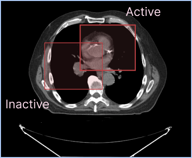

# Active Segmentation

Each ToolGroup can show more than one `Segmentation Representation` at the same time.
However, there is only one `active` segmentation representation. This
`active` segmentation representation is the one that is being used by the segmentation tools.

You can set different configurations for active and inactive segmentation representations.
For instance, for Labelmaps, you can set the `renderFill` and `renderOutline` properties
for the active and inactive segmentation representations separately.



As you see in the picture above, you can display two different labelmaps at the same time.
Default configuration for active segmentation representation is to have a higher outline width
value than the inactive segmentation representation in order to make the active segmentation
representation more visible.

## API

Active Segmentation API provides setters and getters for the active segmentation representation.

```js
import { segmentation } from '@cornerstonejs/tools';

// get the active segmentation representation for a toolGroup
segmentation.getActiveSegmentationRepresentation(toolGroupId);

// set the active segmentation representation for a toolGroup
segmentation.setActiveSegmentationRepresentation(
  toolGroupId,
  representationUID
);
```
